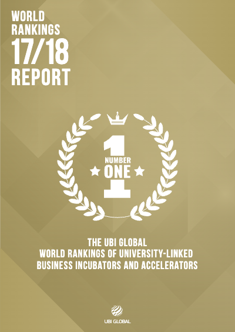

# World Rankings Report 2017 - 2018

## Summary

The UBI Global World Rankings Report 2017-2018 highlights leading university-linked business incubators and accelerators from 259 programs across 53 countries. It explains how the ranking framework compares ecosystem value, startup support, and operational excellence across global peers.

By recognizing top-performing programs, the report gives universities, program managers, and ecosystem leaders a practical benchmark for understanding what strong incubation performance looked like in this study cycle.

## Cover Image

## Highlights

* Program classification
* Landscape and methodology overview
* Benchmark and ranking framework
* Ranking and recognition overview
* Featured program directory

## Access the Report

* [Open the interactive preview](https://pdf.ubi-global.com/wrr1718?title=WorldRankingsReport2017-2018)
* [Join UBI Global](https://ubi-global.com/membership)

## Related Publications

* [World Rankings Report 2021 - 2022](world-rankings-report-2021-2022.md)
* [World Rankings Report 2019 - 2020](world-rankings-report-2019-2020.md)
* [World Benchmark Report 2017 - 2018](../benchmark-reports/world-benchmark-report-2017-2018.md)
* [Best Practices at Top University-linked Business Incubators - Vol 1](../case-studies/best-practices-at-top-university-linked-business-incubators-vol-1.md)

## Source

* Migrated from the current Compass GitBook page on 2026-03-29
* Source URL: https://openlibrary.gitbook.io/compass/publications-and-reports/benchmark-and-ranking-reports/world-rankings-report-2021-2022-1
