# Compass Editorial Workflow Handoff

Hey team,

We have now standardized the Compass editorial workflow so content can be created collaboratively without losing control of what gets published.

## What Changed

Compass now uses a clear default stack:

- Shared Drive for shared working files
- Google Docs for drafting and editorial review
- Google Sheets for tracking, metadata, and publish readiness
- Repo Markdown for approved publishable content
- GitBook for the live public experience

## Why This Matters

This gives non-technical editors a comfortable working environment while keeping the repository as the single source of truth for anything that goes live.

It also gives us a cleaner way to handle:

- terminology updates
- KPI and publication drafts
- image and video handoff
- ownership and status tracking
- consistent naming and folder structure

## Team Rule Of Thumb

- If people are discussing wording, use Google Docs.
- If people are tracking status, ownership, or metadata, use Google Sheets.
- If a file is still a working asset, keep it in Shared Drive.
- If the content is approved and should be published, move it into the repo.
- If it is public, GitBook should be reading it from the repo, not from Workspace.

## Shared Drive Structure

```text
Compass Shared Drive/
  01 Intake/
  02 Drafts/
  03 Structured Data/
  04 Media/
  05 Video/
  06 Publish Queue/
  07 Published Reference/
  99 Archive/
```

## Workflow

```mermaid
flowchart LR
    A["Request or source arrives"] --> B["Google Sheet<br/>Content Tracker"]
    B --> C["Google Doc draft<br/>in 02 Drafts"]
    C --> D["Review and approval<br/>in Google Docs"]
    D --> E["Assets prepared<br/>04 Media / 05 Video"]
    E --> F["Ready for repo<br/>06 Publish Queue"]
    F --> G["Convert approved content<br/>to docs/*.md"]
    G --> H["Copy final publishable images<br/>to docs/media/..."]
    H --> I["Embed public video URL<br/>in Markdown"]
    I --> J["Commit and push repo"]
    J --> K["GitBook publishes live site"]
    K --> L["Update Sheet with repo path<br/>and live URL"]
```



## Starter Assets

- Workflow guide: `editorial/GOOGLE-WORKSPACE-WORKFLOW.md`
- Tracker spec: `editorial/CONTENT-TRACKER-SPEC.md`
- Naming conventions: `editorial/SHARED-DRIVE-NAMING-CONVENTIONS.md`
- Team visual: `editorial/TEAM-WORKFLOW-VISUAL.md`
- Starter workbook: `output/spreadsheet/Compass Content Tracker.xlsx`

## Immediate Next Step

Upload the starter workbook to the Compass Shared Drive, open it in Google Sheets, and start using it as the master tracker for terminology, KPI, publication, media, and video work.
