# Compass Editorial Workflow Visual

## Default Stack

- Shared Drive for shared working files
- Google Docs for drafting and review
- Google Sheets for tracking and publish readiness
- Repo Markdown for canonical approved content
- GitBook for public delivery

## Workflow Diagram

```mermaid
flowchart LR
    A["Request or source arrives"] --> B["Google Sheet<br/>Content Tracker"]
    B --> C["Google Doc draft<br/>in 02 Drafts"]
    C --> D["Review and approval<br/>in Google Docs"]
    D --> E["Assets prepared<br/>04 Media / 05 Video"]
    E --> F["Ready for repo<br/>06 Publish Queue"]
    F --> G["Convert approved content<br/>to docs/*.md"]
    G --> H["Copy final publishable images<br/>to docs/media/..."]
    H --> I["Embed public video URL<br/>in Markdown"]
    I --> J["Commit and push repo"]
    J --> K["GitBook publishes live site"]
    K --> L["Update Sheet with repo path<br/>and live URL"]
```

## What Lives Where

| Layer | Tool | Purpose |
|------|------|---------|
| Collaboration | Shared Drive | Shared folders for drafts, media, video, and publish queue |
| Drafting | Google Docs | Page copy, SME comments, editorial review |
| Tracking | Google Sheets | Status, metadata, owner, links, repo path, live URL |
| Canonical content | Repo `docs/` | Approved Markdown and final publishable images |
| Publishing | GitBook | Public-facing Compass site |

## Team Rule Of Thumb

- If people are discussing wording, use Google Docs.
- If people are tracking status, ownership, or metadata, use Google Sheets.
- If the content is approved, move it into the repo.
- If it is public, GitBook should be reading it from the repo, not from Workspace.

## Starter Assets

- Workflow guide: `editorial/GOOGLE-WORKSPACE-WORKFLOW.md`
- Tracker spec: `editorial/CONTENT-TRACKER-SPEC.md`
- Naming conventions: `editorial/SHARED-DRIVE-NAMING-CONVENTIONS.md`
- Starter workbook: `output/spreadsheet/Compass Content Tracker.xlsx`
